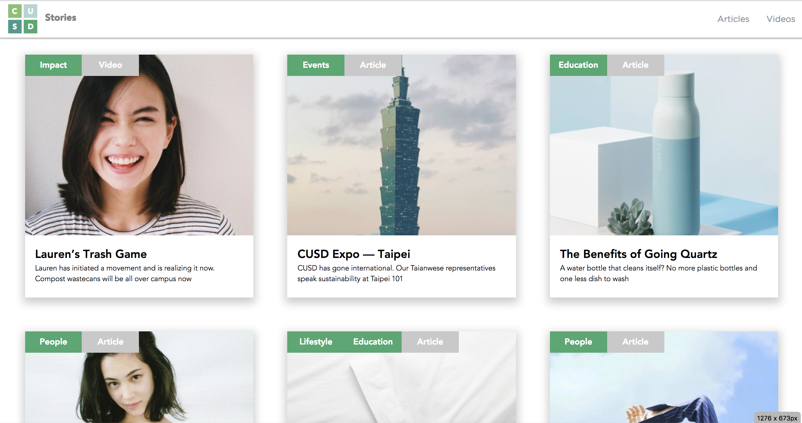
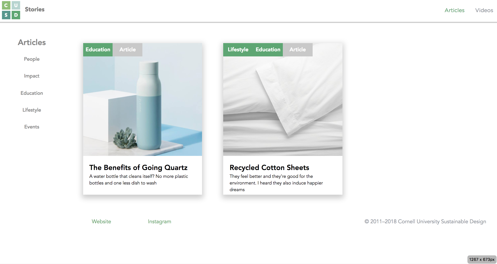

# [CUSD Stories](https://cusd-stories.herokuapp.com/)

A place to read about all the great things made by the members of [Cornell University Sustainable Design](https://cusd.cornell.edu/).

### Technicalities
The site is build using PHP 7.1 and the [Materialize.css](http://materializecss.com/about.html) framework. It is deployed on [Heroku](https://devcenter.heroku.com/start). For styling ease, SCSS [(Sass)](https://sass-lang.com/) is used.

This site was designed by the Marketing and Communications (Marcomm) subteam and built/deployed by the Technical Operations (TechOps) subteam in Spring 2018

Any technical questions? Feel free to contact me at gjs86@cornell.edu

## Screenshots

---

#### A glimpse of the homepage, featuring both Article and Video Stories by CUSD members

---

#### The Articles page, with the ability to AJAX sort based on tag

